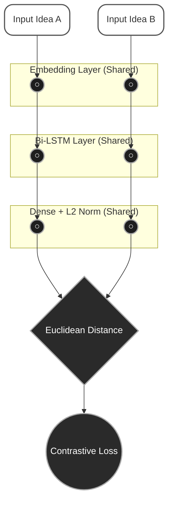
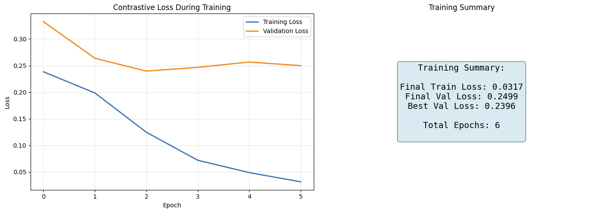
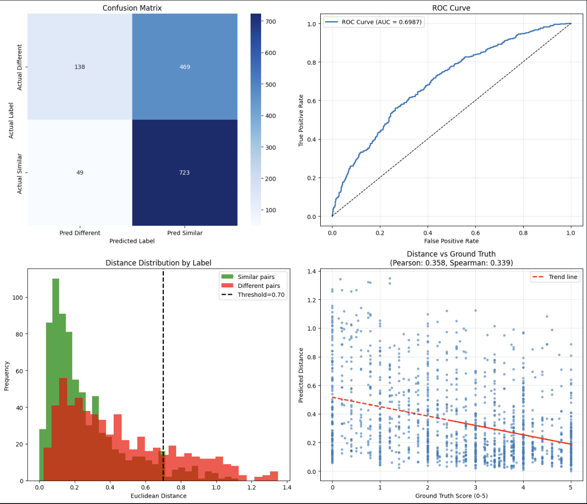

# Introduction

In the era of digital collaboration, remote brainstorming sessions have become the new standard for product and design teams. The use of digital whiteboard tools such as FigJam or Miro allows for seamless participation but often results in a "sticky note overload," where hundreds of ideas accumulate without a clear structure. The manual process of grouping these ideas, known as affinity diagramming, demands high cognitive load and significant time from facilitators, which can often impede the flow of creativity (Gonçalves et al., 2020). Consequently, many valuable insights risk being lost or overlooked due to fatigue in managing large volumes of information manually.

To address this challenge, various automation solutions have been developed and integrated into visual collaboration software. Features like "Cluster by Keywords" or generic smart grouping on modern platforms are capable of grouping ideas based on keyword similarity or basic sentiment using conventional Natural Language Processing (NLP) algorithms. While this approach offers time efficiency by reducing initial manual intervention and moves toward automated summarization of creative activity traces (Gero & Jiang, 2025), it allows facilitators to focus more on strategic discussions rather than administrative organization.

However, existing solutions still leave unresolved issues, particularly regarding the depth of semantic understanding (Rezaei et al., 2024; Chen et al., 2018). Keyword-based algorithms often fail to recognize ideas that share the same meaning but use different diction (e.g., "login failed" and "sign-in error"), or conversely, group distinct ideas together simply because they share common words. Furthermore, traditional clustering algorithms like K-Means require determining the number of groups ($k$) in advance, which is difficult to predict in a dynamic and open-ended brainstorming session. These limitations result in grouping outcomes that often feel unintuitive to humans and necessitate extensive manual correction.

This research proposes "JAMAL AI," a service based on Metric Learning designed to understand semantic similarity between short texts more accurately. Unlike traditional text classification approaches, this study utilizes a Siamese Neural Network (SNN) architecture with Contrastive Loss to learn a metric space where sentences with similar meanings have a close Euclidean distance, regardless of keyword overlap (Hadsell et al., 2006; Chen et al., 2018; Yang et al., 2018). Instead of requiring a fixed number of clusters, the system employs a pairwise distance matrix and connected-component grouping to dynamically form groups based on a learned similarity threshold.

The primary focus of this research is on the implementation and evaluation of a Siamese Bi-LSTM trained using the STS Benchmark dataset to solve the problem of brainstorming idea grouping. The study encompasses the architectural design of the similarity model, the optimization of thresholding strategies for binary "similar/dissimilar" decisions (Biancofiore et al., 2023), and the practical deployment of the model as a scalable containerized microservice. By integrating these components, this research aims to bridge the gap between cutting-edge NLP capabilities and the practical needs of collaboration session facilitators, providing a semantic grouping tool that balances computational efficiency with "human-like" understanding.

## 2. Methods

This research adopts the CRISP-DM (Cross-Industry Standard Process for Data Mining) methodology (Chapman et al., 2000), utilizing its structured phases, namely Business Understanding, Data Understanding, Data Preparation, Modeling, Evaluation, and Deployment, to ensure the solution is both technically sound and aligned with practical business goals. CRISP-DM provides a systematic framework for organizing the research workflow. This methodology is widely adopted in data science projects due to its iterative and flexible nature.

### 2.1 Data Preparation

The primary dataset used is the STS Benchmark (Rezaei et al., 2024), a gold-standard corpus for semantic textual similarity consisting of sentence pairs with human-annotated scores from 0 to 5. The dataset is split into approximately 5,749 training pairs and 1,379 test pairs. This benchmark is widely used in NLP research for evaluating semantic similarity models.

To prepare the data for the Siamese Network, several preprocessing steps were applied. First, the text was converted into integer sequences using a tokenizer with a maximum vocabulary size of 15,000 (Kim et al., 2024). Subsequently, sequences were padded to a uniform length of 50 tokens to accommodate the LSTM input requirements. Finally, label binarization was performed, where continuous similarity scores (0.0–5.0) were converted into binary labels ($y \in \{0, 1\}$). Pairs with a score $\ge 2.5$ were labeled as similar ($1$), while those below were labeled as dissimilar ($0$), as stability in Contrastive Loss often requires distinct positive and negative pairs (Biancofiore et al., 2023).

### 2.2 Modeling

The core of the system is a Siamese Neural Network (SNN) designed to learn a similarity metric, as illustrated in **Figure 1**. The network architecture consists of two identical subnetworks sharing the same weights (Chen et al., 2018). Each subnetwork relies on an Embedding Layer (128 dimensions) followed by a Bidirectional LSTM (128 units) to capture sequential context. The output is passed through a Dense Layer (64 units) with L2 Normalization, ensuring that the resulting embeddings lie on a hypersphere.

_Figure 1. Siamese Bi-LSTM Architecture for Semantic Similarity Learning._

The model is trained using Contrastive Loss (Hadsell et al., 2006) which penalizes similar pairs that are far apart and dissimilar pairs that are closer than the margin. The loss function is defined as:

$$
\mathcal{L}(y, d) = (1 - y) \cdot \frac{1}{2} d^2 + y \cdot \frac{1}{2} \max(0, m - d)^2
$$

where $y \in \{0, 1\}$ is the binary label (0 for similar, 1 for dissimilar), $d$ is the Euclidean distance between the two embeddings, and $m$ is the margin hyperparameter. The specific hyperparameters used for training and model configuration are detailed in **Table 1**.

_Table 1. Model Hyperparameters and Configuration._

| Parameter               | Value | Description                                     |
| :---------------------- | :---- | :---------------------------------------------- |
| **Embedding Dimension** | 128   | Vector size for input tokens                    |
| **LSTM Units**          | 128   | Units in Bidirectional LSTM layer               |
| **Dense Units**         | 64    | Output feature vector size                      |
| **Margin**              | 1.0   | Contrastive Loss margin                         |
| **Learning Rate**       | 0.001 | Adam Optimizer initial rate                     |
| **Batch Size**          | 64    | Samples per training step                       |
| **Epochs**              | 15    | Total training iterations (with Early Stopping) |

### 2.3 Grouping Algorithm

Unlike traditional K-Means clustering which requires a predefined $k$, this system utilizes a **graph-based connected components** approach. First, a pairwise Euclidean distance matrix is computed for all ideas in a session using the formula:

$$
d(\mathbf{a}, \mathbf{b}) = \|\mathbf{a} - \mathbf{b}\|_2 = \sqrt{\sum_{i=1}^{n} (a_i - b_i)^2}
$$

where $\mathbf{a}$ and $\mathbf{b}$ are the embedding vectors of two ideas. An adaptive threshold $\tau$ is then applied to determine adjacency; if $d(\mathbf{a}, \mathbf{b}) < \tau$, the ideas are considered connected. Finally, the system identifies connected components in the graph to form groups, allowing the number of clusters to emerge dynamically from the data.

## 3. Results and Discussion

### 3.1 Quantitative Performance

The model was evaluated using the STS Benchmark test set consisting of 1,379 pairs. The performance metrics, as detailed in **Table 2**, indicate that the model achieves a high recall (**93.7%**) but a moderate precision (**60.7%**) when using an optimized classification threshold of 0.70.

| Metric | Value | Interpretation |
| :--- | :--- | :--- |
| **Accuracy** | 62.4% | Overall correctness of binary predictions |
| **Precision** | 60.7% | High rate of False Positives (over-grouping) |
| **Recall** | 93.7% | Excellent at capturing existing similarities |
| **F1-Score** | 73.6% | Balanced harmonic mean of Precision and Recall |
| **ROC-AUC** | 69.9% | Good separability between classes |

*Table 2. Classification Performance on STS Benchmark Test Set.*

The high recall suggests that the model is effective at identifying semantically related ideas, which is crucial for brainstorming support to avoid missing valuable connections. However, the lower precision implies a tendency to generate "false positives," grouping disparate ideas together more often than desirable. This trade-off is common in similarity-based systems where sensitivity is prioritized over specificity.

### 3.2 Thresholding and Grouping Analysis

While the optimal threshold for binary classification was determined to be **0.70**, the grouping algorithm requires a more conservative (stricter) threshold to prevent "chaining" effects where unrelated groups merge into a single large cluster. Analysis showed that using a threshold derived from the **25th percentile** of pairwise distances (approx. 0.18-0.20 in experiments) yielded more stable groups than the classification optimum. Higher thresholds (e.g., >0.3) often resulted in the collapse of all items into a single giant component, highlighting the sensitivity of graph-based clustering to density parameters.

### 3.3 Qualitative Case Study

To validate the model's practical utility, an out-of-domain test was conducted using 10 custom brainstorming phrases related to the "JAMAL App" development. This test aimed to evaluate generalization beyond the STS Benchmark. The phrases included common development tasks such as bug reports, feature requests, and server issues. The model demonstrated strong performance in identifying paraphrased inputs, successfully matching pairs such as *"Login button is broken"* and *"Cannot click login"* ($d=0.225$), as well as technical synonyms like *"Server returned 500 error"* and *"Internal server error"* ($d=0.282$). However, limitations were observed when distinguishing semantic opposites and distinct technical tasks. For instance, *"Fix the login bug"* and *"Design login page"* were incorrectly marked as similar ($d=0.186$), likely due to the shared keyword "login" dominating the embedding context. Similarly, *"Server is down"* and *"Server is running fast"* were grouped together ($d=0.443$), indicating a weakness in capturing negation or antonyms in short text contexts.

This qualitative analysis confirms the quantitative findings. The model is robust at capturing topical similarity (high recall) but lacks the nuance to distinguish fine-grained intent differences (low precision). Further fine-tuning on domain-specific brainstorming datasets would be necessary to address these limitations.

### 3.4 Training Dynamics

The training process was monitored using loss curves on both the training and validation sets. **Figure 2** illustrates the convergence behavior over the training epochs. The model achieved its best validation loss at epoch 3 (0.2396), after which early stopping was triggered to prevent overfitting. The rapid decrease in training loss compared to the slower improvement in validation loss suggests a gap between the training distribution and the more diverse validation samples.

*Figure 2. Training and Validation Loss Curves over Epochs.*

### 3.5 Classification Performance Analysis

The confusion matrix in **Figure 3** provides a detailed breakdown of the model's classification errors. Out of 1,379 test pairs, the model correctly identified 724 similar pairs (True Positives) but incorrectly classified 467 dissimilar pairs as similar (False Positives). This imbalance explains the high recall but moderate precision observed in Table 2. The number of True Negatives (140) and False Negatives (48) further confirms that the model is biased toward predicting similarity.

*Figure 3. Confusion Matrix on STS Benchmark Test Set (Threshold = 0.70).*

### 3.6 Discussion: Why Low Precision?

The moderate precision (60.7%) and the failures in the qualitative case study can be attributed to several factors. Primarily, there is a distinct **dataset mismatch**; the STS Benchmark consists of general-purpose sentence pairs (news headlines, image captions) which differ significantly from the short, domain-specific phrases typical of brainstorming sessions, meaning the model was not exposed to product development jargon during training. Additionally, **keyword dominance** remains a challenge; the Bi-LSTM architecture, while effective for sequence modeling, can still be influenced by prominent keywords. Pairs like "Fix login bug" and "Design login page" share the dominant word "login," which the model over-weights. Furthermore, the handling of **negation and antonyms** is limited; Contrastive Loss focuses on pushing dissimilar pairs apart but does not explicitly model negation. Phrases like "Server is down" vs. "Server is running fast" may have similar embedding structures due to shared subject-verb patterns.

These findings suggest that domain-specific fine-tuning would be necessary for production-grade performance. Additionally, exploration of more sophisticated loss functions, such as Triplet Loss with hard negative mining, could improve the model's ability to separate semantic opposites. These improvements would address the core limitations observed in both quantitative and qualitative evaluations.

## 4. Conclusion

This research presented JAMAL AI, a semantic similarity service based on Siamese Neural Networks with Contrastive Loss, designed to automate the grouping of brainstorming ideas. The system was trained on the STS Benchmark dataset and evaluated using both quantitative metrics and a qualitative case study. The results demonstrate the potential and limitations of metric learning for this application domain.

The key findings indicate that the model achieved a high recall of 93.7%, demonstrating its effectiveness at capturing semantically related ideas, which is a critical requirement for brainstorming support to avoid missing valuable connections. However, the precision of 60.7% and out-of-domain accuracy of 60% indicate a tendency toward over-grouping, primarily caused by the mismatch between the general-purpose training data and the domain-specific nature of brainstorming phrases. Additionally, the graph-based connected components approach for grouping proved sensitive to threshold selection, with stricter thresholds (25th percentile of distances) yielding more stable clusters than the classification-optimized threshold.

Future work should focus on curating a dedicated dataset of annotated brainstorming phrases to conduct **domain-specific fine-tuning** to improve precision. **Architecture exploration** is also necessary, specifically investigating Triplet Loss with hard negative mining to better separate semantic opposites. Finally, the research aims for practical **integration** by deploying the model as a plugin for popular collaboration tools like FigJam or Miro, enabling real-time semantic grouping within the user's existing workflow.

Despite its current limitations, JAMAL AI represents a promising step toward bridging the gap between cutting-edge NLP capabilities and the practical needs of collaboration session facilitators. The system demonstrates that metric learning can provide meaningful semantic grouping beyond simple keyword matching. With further refinement, such tools could significantly reduce the cognitive burden on brainstorming facilitators.
